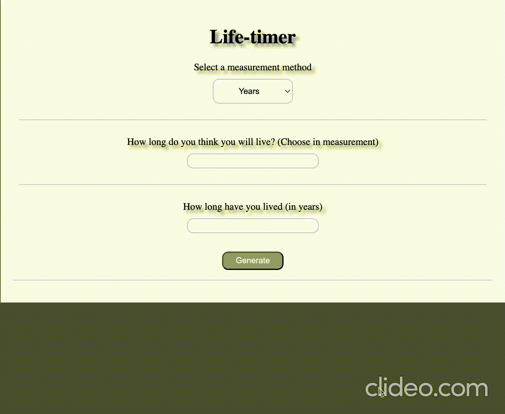

## Live Timer

#### 🌱.........

Этот проект - напоминание. 
Напоминание о том, что время неумолимо. 
Введи свой возраст - и узнай, 
сколько лет, ммесяцев, недель, дней тебе осталось...

Программа просит ввести предпологаемое количество лет, 
которое вам осталось прожить. 
Это не просто числа. 
Это твоя жизнь. 

Посмотри на нее. Подумай. 
И реши, на что ты хочешь потратить остаток своего времени. 

Так же была добавлена возможность добавлять свои заметки, 
например, когда произошло поступление в ВУЗ 
или когда вы получили свою первую работу, 
а может вы хотите посмотреть когда родился ваш ребенок. 
После этого посмотрите в какой периуд вашей жизнь
произошло то или иное событие и поймите как мало вам осталось....

#### .........☠️

---

### 🛠️ Используемые технологии:

---

### 💻 Демонстрация

### 🔮 Будущие планы: 

- Добвить часы, минуты, секунды. Но добавить не ввиде квадратиков, а просто числа или еще как нибудь визуализировать, пока в процессе размышления
- Сделать более красивый дизайн (мне вроде нравится, в стиле сайтов из 2005, но еще бы хотелось имень возможность менять цвет темы)
- Переписать код ☠️☠️☠️, в .js файл лучше не заходить, там черт ногу сломит, планирую переписть на классы или написать в более функциональном стиле. Это для удобства масштабирования нужн (во второй ветки проекта я уже начал переписывать код)
